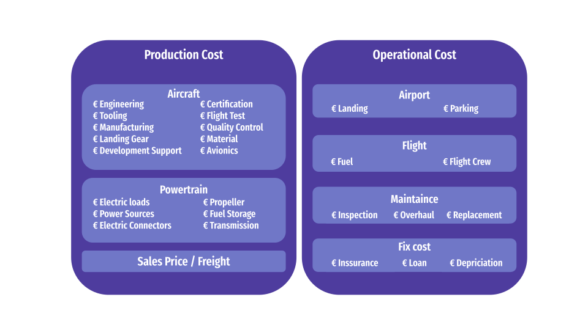

.. _models-lca:

======================
Life Cycle Cost models
======================

The Direct Operating Cost (DOC) of an aircraft can be broken in two main cost categories: the production cost and the operational cost.
The contents of those two categories are detailed in the following descriptions.

.. contents::

*********************
Production cost model
*********************
The aircraft and the powertrain are the two main contributors to production costs. Aircraft production costs are
calculated using the Eastlake model (1986) from :cite:`gudmundsson:2013`. Powertrain component purchase costs are either
based on the Eastlake model (1986) from :cite:`gudmundsson:2013` or estimated from dealers or company websites. The cost
calculations from :cite:`gudmundsson:2013` are based on the USD in 2012. To account for currency depreciation, a cost
adjustment factor :math:`CPI_{\text{2012}}` is introduced. This factor represents the cost price index difference
between 2012 and today.

Aircraft production cost
========================

Cost of engineering, toolong, and manufacturing
***********************************************
The cost of the engineering labor, tooling labor, and manufacturing labor share a similar computation structure. It begins
with estimating the total man-hours required for the development process for the first 5-year production period . Then,
the cost is simply calculated by multiplying the number of human-hour (:math:`H_{\text{labor}}`) and cost rate of labor
(:math:`R_{\text{labor}}`) for each subcategory with the inflation adjustment.

.. math::

    H_{\text{labor}} = f(M_{\text{airframe}},N,V_H,Q_m,F) \\
    C_{\text{labor (\$)}} = 2.0969 \cdot H_{\text{labor}} \cdot R_{\text{labor}} \cdot CPI_{\text{2012}}

:math:`M_{\text{airframe}}` is the weight of airframe, :math:`N` is the number of aircraft produced for a
5-year period, :math:`V_H` maximum cruise true airspeed in knots, :math:`Q_m` is the estimated aircraft production
rate per month, and :math:`F` is the combination of factors based on aircraft design specifications detailed in :cite:`gudmundsson:2013`.

Cost of development support
***************************
Indirect development labor cost, provided by :cite:`gudmundsson:2013`, includes items such as overheads, administration,
logistics, human resources, facilities maintenance during the aircraft development. As numerous types of labor are
included, this cost can not be estimated with a fixed cost rate.

.. math::

    C_{\text{dev (\$)}} = 0.06458 \cdot M_{\text{airframe}}^{0.873} \cdot V_H^{1.89} \cdot N_p^{0.346} \cdot CPI_{\text{2012}}
                    \cdot F

:math:`N_p` is the number of prototype produced during the development period.

Cost of flight test
*******************
The flight test cost, provided by :cite:`gudmundsson:2013`, includes items such as the cost of development and
certification flight test.

.. math::

    C_{\text{ft (\$)}} = 0.009646 \cdot M_{\text{airframe}}^{1.16} \cdot V_H^{1.3718} \cdot N_p^{1.281} \cdot CPI_{\text{2012}}

Cost of quality control (QC)
****************************
The QC cost, provided by :cite:`gudmundsson:2013`, includes items such as the cost of manufacturing quality control, the
cost of technicians and the cost of equipments.

.. math::

    C_{\text{QC (\$)}} = 0.13 * C_{\text{MFG}} * (1 + 0.5f_{\text{comp}})

:math:`C_{\text{MFG}}` is the manufacturing cost of a 5-year period and :math:`f_{\text{comp}}` is the
proportion of the airframe made of composite material.

Cost of materials
*****************
The material cost, provided by :cite:`gudmundsson:2013`, computes the raw material purchase cost for the airframe.

.. math::

    C_{\text{material (\$)}} = 24.896 \cdot  M_{\text{airframe}}^{0.689} \cdot V_H^{0.624} \cdot N^{0.792}
                            \cdot CPI_{\text{2012}} \cdot F_{CF} \cdot F_{\text{press}}

:math:`F_{CF}` is the complex flap system factor = 1.02 if complex flap system are used and  :math:`F_{\text{press}}`
is the pressurized factor = 1.01 if the aircraft has a pressurized cabin.

Cost of certification
*********************
The cost of certification, provided by :cite:`gudmundsson:2013`, is the sum of engineering labor cost, development
support cost, flight test cost, and the tooling labor cost.

.. math::

    C_{\text{certify (\$)}} =  C_{\text{eng}} + C_{\text{dev}} + C_{\text{ft}} + C_{\text{tool}}

Powertrain production cost
==========================

Engine purchase cost
********************
The engine purchase cost calculation obtained from :cite:`gudmundsson:2013`.

.. math::

    C_{\text{engine (\$)}} =
    \begin{cases}
        174 \cdot CPI_{\text{2012}} \cdot P_{\text{BHP}} & \text{if ICE} \\
        377.4 \cdot CPI_{\text{2012}} \cdot P_{\text{SHP}} & \text{if turboshaft}
    \end{cases}

:math:`P_{\text{BHP}}` is the brake-horse power of the internal combustion engine and :math:`P_{\text{SHP}}` is the
shaft-horse power of the turboshaft engine.

Propeller purchase cost
***********************
The propeller purchase cost calculation obtained from :cite:`gudmundsson:2013`.

.. math::

    C_{\text{propeller (\$)}} =
    \begin{cases}
        3145 \cdot CPI_{\text{2012}} & \text{if fixed-pitch} \\
        209.69 \cdot CPI_{\text{2012}} \cdot D_p^2 (\frac {P_{\text{SHP}}}{D_p}) ^{0.12} & \text{if constant-speed}
    \end{cases}

:math:`D_p` is the diameter of the propeller and :math:`P_{\text{SHP}}` is the shaft-horse power applied to the propeller.

Synchronous motor / Generator purchase cost
*******************************************
This unit purchase cost is obtained from regression model based on product retail prices
of `Emrax <https://emrax.com/e-motors/>`_.

.. math::

    C_{\text{motor (\$)}} = 893.51 \cdot e^{0.0281 P_{\text{max, cont.}} }

:math:`P_{\text{max, cont.}}` is the maximum continuous power of the motor / generator.

Battery purchase cost
*********************
Battery purchase cost is modeled with power regression from :cite:`Wesley:2023`.

.. math::

    C_{\text{bat (\$)}} = 1.08 \cdot C_{2022} \cdot E_{\text{bat}} \cdot Y_{2022}^{-0.228}

:math:`C_{2022}` is the energy per dollar of battery in 2022, :math:`E_{bat}` is the maximum energy supply from battery,
and :math:`Y_{2022}` is the amount of year from 2022.

DC cable purchase cost
**********************
The purchase cost DC cable is based on the metal material cost, non-metal material cost, and the gross
margin (:math:`\Gamma_{\text{gross}}`) of the cable manufacturing industry. The material cost assumption is detailed
in :ref:`assumptions <assumptions-lcc>`.

.. math::

    C_{\text{cable (\$)}} =\sum \frac{ C_n \cdot V_n}{1 - \Gamma_{\text{gross}}}

Where :math:`n \in \{\text{core, insulation, shield, sheath}\}`

Inverter/ DC-DC converter purchase cost
***************************************
The purchase cost of both electronics are obtained from logarithmic regression based on the retail price of
`MidContinent <https://www.mcico.com/truebluepower>`_.

.. math::

    C_{\text{inverter (\$)}} = 2167 \cdot \ln{P_{inv}} + 6910 \\
    C_{\text{converter (\$)}} = 733 \cdot \ln{P_{con}} + 2295

:math:`P_{inv}` is the inverter power rating and :math:`P_{con}` is the converter power rating.

Rectifier purchase cost
***********************
The purchase cost of the rectifier is obtained from linear regression with the maximum AC current (:math:`I_{AC}`)
and the retail price of `ATO <https://www.ato.com/plating-rectifier>`_.

.. math::

    C_{\text{rectifier (\$)}} = 1.72 \cdot I_{AC} + 2034

DC SSPC purchase cost
*********************
The purchase cost of the DC SSPC is based on the price of IGBT modules from `Semikron <https://www.semikron-danfoss.com/>`_,
the maximum current (:math:`I_{max}`), and a price adjust factor (:math:`k_{\text{SSPC}}`) to consider price difference.

.. math::

    C_{\text{SSPC (\$)}} = k_{\text{SSPC}} (1.21 \cdot I_{max} + 83.8)

**********************
Operational cost model
**********************
Similar as the production cost model, the operational cost model is also built by separating aircraft and powertrain costs.
As the maintenance cost at aircraft level already includes the cost of the storage tank and transmission mechanisms,
their individual costs are not calculated separately. For all electronics, motors, and battery, the operational
costs are estimated as an annual fraction of their purchase price.

Annual maintenance & miscellaneous cost
***************************************
These cost models are based on a regression derived with the data from
`Guardianjet <https://www.guardianjet.com/jet-aircraft-online-tools>`_.

.. math::

    C_{\text{maintenance (\$)}} =  FH_{\text{year}} \cdot \left(331 - 0.072 \cdot \text{OWE} + 2.75 \times 10^{-5} \cdot \text{OWE}^2\right) \\
    C_{\text{miscellaneous (\$)}} = 80 \cdot FH_{\text{year}}

Annual loan cost
****************
If the aircraft is fully or partially financed by loaning, the annual payback amount is estimated with the formula based
on regular house mortgage from :cite:`gudmundsson:2013`.

.. math::

   C_{\text{loan (\$)}} = \frac{P \cdot R_{\text{interest}}}{1-\frac{1}{(1 + R_{\text{interest}})^n}}

:math:`P` is the principal of the loan, :math:`R_{\text{interest}}` is the annual interest rate, and :math:`n` is the
payback periods.

Annual insurance cost
*********************
Yearly insurance cost estimation provided by :cite:`gudmundsson:2013`, slight value adjustments applied
from `Sunset aviation insurance <https://sunsetais.com/aircraft-hull-liability/>`_.

.. math::

   C_{\text{insurance (\$)}} = 500 + 0.01 \cdot Price

:math:`Price` is the purchase price of the aircraft

Landing / Parking cost
**********************
The aircraft landing and parking cost before VAT obtained from
`Toulouse Blagnac airport <https://www.toulouse.aeroport.fr/sites/default/files/2023-03/2023_03_23_Redevances_A_EN_v1.pdf>`_.

.. raw:: html

   

========================  =======================  =============================================
MTOW (Tons)                Daily parking cost (€)            Landing cost per operation (€)
========================  =======================  =============================================
:math:`w \leq 1.5`               :math:`1.63`                       :math:`31.8`
:math:`1.5 < w \leq 2.5`          :math:`3.2`                       :math:`41.13`
:math:`2.5 < w \leq 6`           :math:`5.49`                         :math:`55.29`
:math:`6 < w \leq 7`            :math:`5.68  w`                 :math:`55.29`
:math:`w > 7`               :math:`5.68  w`                :math:`50.35 + 0.55(w-6)`
========================  =======================  =============================================

.. raw:: html

   

:math:`w` is the MTOW of the aircraft in tons.

Fuel cost
*********
Fuel cost estimation are obtained from :cite:`sens:2024` and `Orleans loire-valley airport <https://orleans.aeroport.fr>`_.

.. raw:: html

   

========================  =======================
Fuel Type                     Unit cost (€/kg)
========================  =======================
    Avgas 100LL                     3.36
    Jet-A1                          2.72
    Diesel                          1.81
Pressurized Hydrogen                6
========================  =======================

.. raw:: html

   

Propeller / Engine maintenance cost
***********************************
The maintenance cost of propeller, turboshaft, and ICE are calculated as the annual split of the overhaul cost, which is
required in a specific operation hours. The overhaul cost of propeller is provided by
`Aircraft accessories of Oklahoma <https://aircraftaccessoriesofok.com/aircraft-propeller-overhaul-cost/>`_.

.. raw:: html

   

==============================  ========================
Propeller Type                  Overhaul cost range (\$)
==============================  ========================
    Fixed-pitch                         840 - 920
    Constant-speed                      2800 - 3400
Constant-speed with turboshaft          4000 - 6800
==============================  ========================

.. raw:: html

   

.. math::

    C_{\text{ICE,overhaul (\$)}} =  \frac{0.103 V_{\text{disp}} - 4.41}{1.8} \\
    C_{\text{turboshaft,overhaul (\$)}} = \frac{0.202 P_{\text{cont}} + 259}{3.5}

:math:`V_{\text{disp}}` is the ICE piston displacement volume and :math:`P_{\text{cont}}` is the maximum continuous
power of the turboshaft engine at sea level.

*********************
Cost model structure
*********************
This diagram presents the structure of the LCC model using the TBM-900 as a support.

.. raw:: html

   <a href="../../../../../n2/n2_tbm_900_lcc.html" target="_blank">LCC N2 diagram with TBM 900</a> 