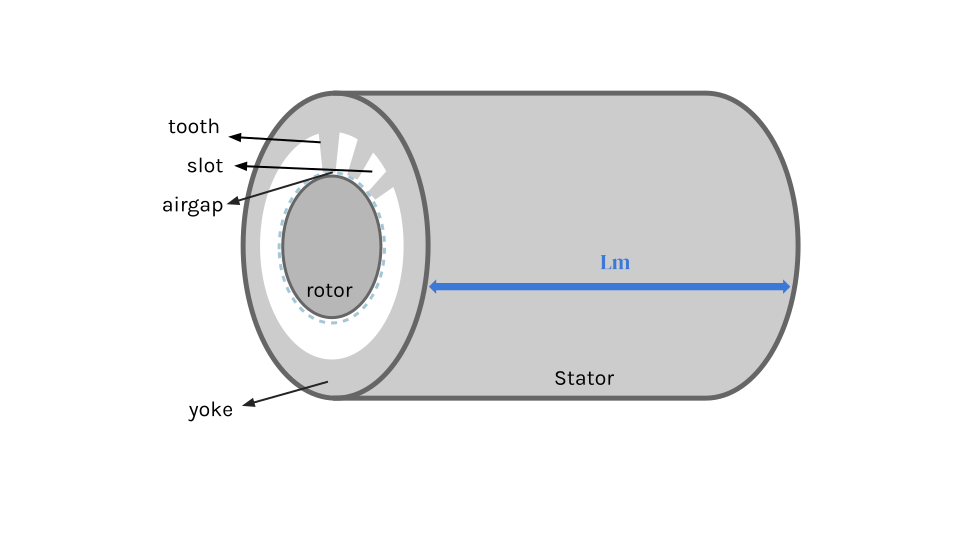
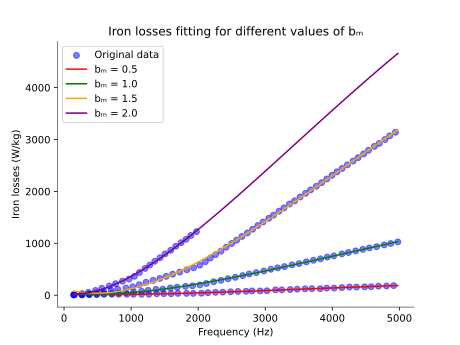

==============================================================
Surface-mounted permanent magnet synchronous motor computation
==============================================================
The sizing and performance modeling for most electric motor are often inaccurate due to the unconventional design.
Therefore, the SM PMSM with nonsalient radial flux and supplied with sinewave currents is selected, based on its
simplicity and having a relative accurate modeling. This figure demonstrate the essential parts of a SM PMSM.

.. contents::

***********************
Performance calculation
***********************
Most of the performance calculations shares a similar approach as the AFPMSM model, except the losses caused by various
factors. The three primary sources of loss in the Surface-mounted PMSM as modeled in the HASTECS project :cite:`touhami:2020` are
presented below.

PMSM Joule losses
===============
Joule losses represent the most important sources of losses in the SMPMSM. It is caused by Ohmic heating in the conductor wires winding
of the PMSM stator. At low operating speeds, the current density is evenly distributed across the wire’s
cross-section. To calculate the joule loss, the wire resistance must be determined first.

.. math::
    R_s = \frac{N_c}{q} \cdot \rho_{cu}(T_{win}) \\
    \rho_{cu}(T_{win}) = \rho_{cu20^\circ} [1 + \alpha_{th}(T_{win} - 20^\circ)]

Where :math:`N_c` is the number of conductors,  :math:`q` is the number of phase in PMSM, :math:`T_{win}` is the the
temperature of the wire windings, :math:`\alpha_{th}` is the electrical resistance coefficient of copper, and
:math:`\rho_{cu20^\circ}` copper density at :math:`20^{\circ}C`.

With the wire electrical resistance and the RMS current (:math:`I_{rms}`), the Joule losses can be written as:

.. math::
    P_j = q \cdot R_s \cdot I_{rms}^2

PMSM iron loss
==============
As the second largest contributor to the PMSM performance losses, the iron losses arises from eddy current and the continuous
variation of the magnetic flux. To better capture the behavior of the SM PMSM, a regression model using Least Squared
Method by HASTECS project :cite:`touhami:2020` is considered.

.. math::
    P_{ir} = \sum_{i=1}^{i=4}\sum_{j=1}^{j=4} a_{ij}(\sqrt{B_m})^j(\sqrt{f})^i

:math:`B_m` is the maximum magnetic flux density and :math:`f` is the magnetic field switching frequency.

The iron loss coefficients (:math:`a_{ij}`) are verified with empirical data provided by HASTECS project
:cite:`touhami:2020`.

PMSM mechanical loss
====================
Mechanical losses (:math:`P_{mech}`) are the consequence of various phenomenons including, friction between air and rotor or
friction between a stationary solid and a rotating solid.

.. math::
    P_{mech} = P_{windage} + 2 P_{bf}

The two major windage losses (:math:`P_{windage}`) result from the fluid friction
between the air inthe component gaps and the rotor. The airgap windage loss (:math:`P_{wa}`) occurs because of the fluid
friction between the stator and rotor while rotating. Similarly, the rotor windage loss (:math:`P_{wr}`) arises from the
space between both ends of the rotor and the motor casing. The rotor radius is denoted as :math:`R_{r}`, the shaft
radius as :math:`R_{sh}`, the rotation speed as :math:`\Omega`, and the motor length as :math:`L`.

.. math::
    P_{windage} = P_{wa} + 2P_{wr} \\
    P_{wa} = k_1 C_{fa} \pi \rho_{air} \Omega^3 R_r^4 L \\
    P_{wr} = \frac{1}{2}C_{fr} \pi \rho_{air} \Omega^3(R_r^5 - R_{sh}^5)

Where the friction coefficient of airgap windage loss (:math:`C_{fa}`) and the friction coefficient of rotor windage
loss (:math:`C_{fr}`) are:

.. math::
    C_{fa} = \begin{cases}
    0.515 \frac{(e_g/R_r)^{0.3}}{Re_{a}^{0.5}} & \text{for laminar flow } 500 < Re_{a} < 10^4 \\
    0.0325 \frac{(e_g/R_r)^{0.3}}{Re_{a}^{0.2}} & \text{for turbulent flow } Re_{a} > 10^4
    \end{cases} \\

.. math::
    C_{fr} = \begin{cases}
    \frac{3.87}{Re_{rt}^{0.5}} & \text{for laminar flow } Re_{rt} \leq 3.5 \cdot 10^5 \\
    \frac{0.146}{Re_{rt}^{0.2}} & \text{for turbulent flow } Re_{rt} > 3.5 \cdot 10^5
    \end{cases} \\

:math:`e_g` is the airgap thickness.

With the air pressure expressed as :math:`pr`, the air density (:math:`\rho_{air}`) and the air dynamic viscosity
(:math:`\mu_{air}`) to derive the Reynolds numbers are:

.. math::
    \rho_{air}(T,pr) = 1.293 \cdot \frac{273.15}{T} \cdot pr \\
    \mu_{air}(T,1 \ atm) = 8.88 \cdot 10^{−15}T^3 − 3.23 \cdot 10^{−11}T^2 + 6.26 \cdot 10^{−8} T + 2.35 \cdot 10^{−6}

And the Reynolds numbers for both losses are:

.. math::
   Re_{a} = \frac{\rho_{air} R_r e_g}{\Omega} \\
   Re_{rt} = \frac{\rho_{air} R_r^2}{\mu_{air}} \Omega

The bearing friction loss is another major contributor to the friction loss between a moving surface and a stationary 
surface. A simplified model for  the bearing friction coefficient (:math:`C_{fb}`) is provided for various bearing type based on SKF's bearing datasheets :cite:`skf:2016`.

.. raw:: html

   

==================================   ===================================
Bearing types                        Friction coefficient :math:`C_{fb}`
==================================   ===================================
Deep groove ball bearings            :math:`0.0015`
Cylindrical roller bearings
- with cage                           :math:`0.0011`
- full complement                     :math:`0.0020`
Spherical toroidal roller bearings    :math:`0.0018`
CARB toroidal roller bearings         :math:`0.0016`
Angular contact ball bearings
- single row                          :math:`0.0020`
- double row                          :math:`0.0024`
- four-point contact                  :math:`0.0024`
Hybrid bearings                       --
==================================   ===================================

.. raw:: html

   

.. math::
    P_{bf} = \frac{1}{2}C_{fb} \cdot P \cdot d_{bb} \cdot \Omega \\
    P = W_{rt} \cdot g

:math:`W_{rt}` is the rotor weight, :math:`d_{bb}` is the bearing bore diameter and the :math:`g` is the gravitational
constant.

******************
Sizing calculation
******************

SM PMSM dimension calculation
=============================
From the electric current balance and magnetic flux balance, the stator bore radius (:math:`R_{rt}`), the active length
(:math:`L_{m}`), the conductor slot height (:math:`h_{s}`), and the yoke thickness (:math:`h_{y}`) can be derived.

.. math::
    R_{rt} = \sqrt[3]{\frac{\lambda}{4\pi\sigma}\frac{P_{em}}{\Omega}} \\
    L_m = (\frac{2}{\lambda})\sqrt[3]{\frac{\lambda}{4\pi\sigma}\frac{P_{em}}{\Omega}}

:math:`\lambda = 2 R/L_m` is the shape coefficient, :math:`\sigma` is the tangential stress, and :math:`P_{em}` is the
given electromagnetic power.

.. math::
    h_s = \frac{\sqrt{2}\sigma}{k_w B_m j_{rms} k_{sc} k_{fill}} (1-r_{tooth})^{-1}

.. math::
    h_y = \frac{R_{rt}}{p} \sqrt{(\frac{B_{m}}{B_{sy}})^2 + \mu_o^2 (\frac{K_m}{B_{sy}})^2 \tau_{x2p}^2}

.. math::
    r_{tooth} = \frac{2}{\pi} \sqrt{(\frac{B_{m}}{B_{st}})^2 + \mu_o^2 (\frac{K_m}{B_{st}})^2 \tau_{x2p}^2} \\
    \tau_{x2p}^2 = \frac{1+x^{2p}}{1-x^{2p}}

.. raw:: html

   

==================================   =================================================================
Variable                               Explanation
==================================   =================================================================
:math:`B_m`                             Max airgap magnetic flux density
:math:`K_m`                             Max electric surface current density
:math:`B_{st}`                          Magnetic flux density in teeth
:math:`B_{sy}`                          Magnetic flux density in the yoke
:math:`j_{rms}`                         RMS current density
:math:`p`                               Number of pole pairs
:math:`k_{fill}`                        Cross section ratio between a slot and the wires in the slots
:math:`k_{sc}`                          Wire cross section ratio between straight cut and tilted cut
:math:`k_w`                             Wire winding coefficient
:math:`x`                               Radius ratio of the rotor radius and the stator bore radius
==================================   =================================================================

.. raw:: html

   

SM PMSM weight calculation
==========================
The weight of the SM PMSM is the sum of the weights of all fundamental components, the stator core weight (:math:`W_{stc}`),
the stator winding weight (:math:`W_{stw}`), the rotor weight (:math:`W_{rt}`) , and the frame weight (:math:`W_{f}`).

.. math::
    W_{stc} = [\pi \cdot L_m (R_{out}^2-R^2) - (h_s \cdot L_m \cdot N_s \cdot l_s)] \rho_{stc}

.. math::
    W_{stw} = [k_{tb} k_{tc} h_s L_m N_s l_s][k_{fill} \rho_c (1 - k_{fill}) \rho_{ins}]

.. raw:: html

   

==================================   =================================================================
Variable                               Explanation
==================================   =================================================================
:math:`N_s`                             Number of the wire slots
:math:`k_{tb}`                          Cross section ratio between a slot and the wires in the slots
:math:`k_{tc}`                          Conductor wire twisting coefficient
:math:`ls`                              Slot width
:math:`\rho_{stc}`                      Stator core material density
:math:`\rho_{stw}`                      Stator winding (teeth) material density
:math:`\rho_{c}`                        Conductor wire material density
:math:`\rho_{ins}`                      Wire insulation material density
==================================   =================================================================

.. raw:: html

   

.. math::
    W_{rt} = \pi R_r^2 L_m \rho_{rt}(p) \\
    \rho_{rt}(p) = \begin{cases}
    −431.67 p + 7932 & \text{for} p \leq 10 \\
    1.09 p^2 − 117.45 p + 4681 & \text{for} 10 < p \leq 50 \\
    1600 & \text{for} p > 50
    \end{cases} \\

:math:`R_r` is the rotor radius and the :math:`\rho_{rt}` is the rotor material density.

.. math::
    W_{f} = \rho_{fr} (\pi L_m k_{tb} (R_{fr}^2 - R_{out}^2) + 2 \pi (\tau_r(R_{out}) - 1) R_{out} R_{fr}^2) \\
    \tau_r(R_{out}) = \begin{cases}
    0.7371 R_{out}^2 − 0.580 R_{out} + 1.1599 & \text{for} R_{out} \leq 400mm \\
    1.04 & \text{for} R_{out} > 400mm \\
    \end{cases} \\

:math:`R_{fr}` is the frame radius, :math:`R_{out}` is the outer stator diameter, and :math:`\tau_r` is the ratio
of :math:`R_{fr}` and :math:`R_{out}`.

*******************************
Component Computation Structure
*******************************
The following two links are the N2 diagrams representing the performance and sizing computation for the Surface-Mounted PMSM model.
(SM PMSM) component.

.. raw:: html

   <a href="../../../../../../../n2/n2_performance_sm_pmsm.html" target="_blank">SM PMSM performance N2 diagram</a> 
   <a href="../../../../../../../n2/n2_sizing_sm_pmsm.html" target="_blank">SM PMSM sizing N2 diagram</a>

