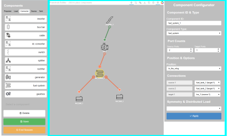
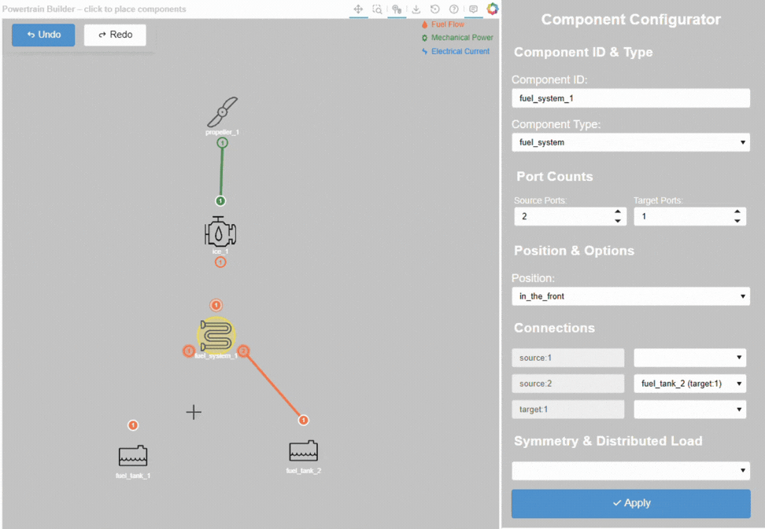
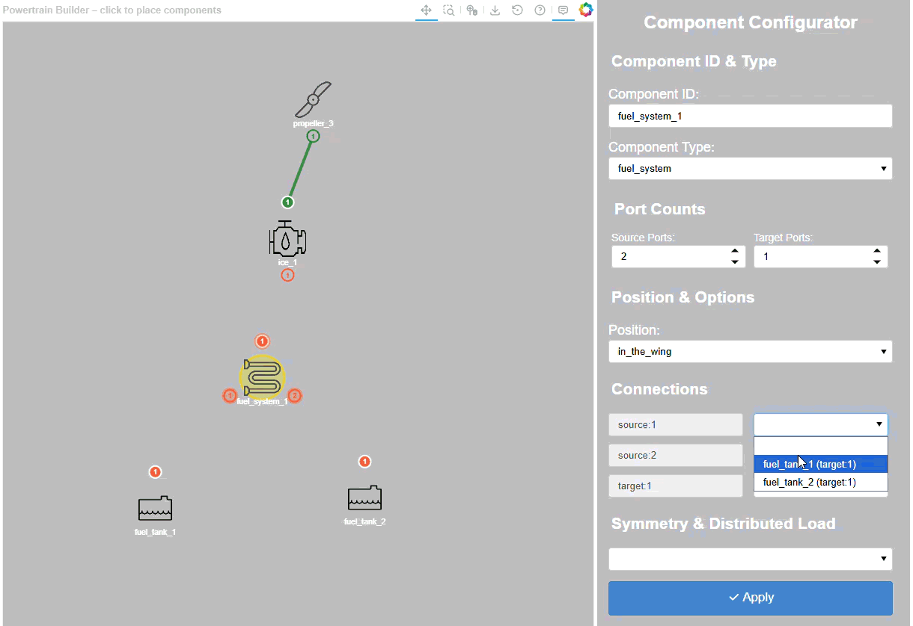
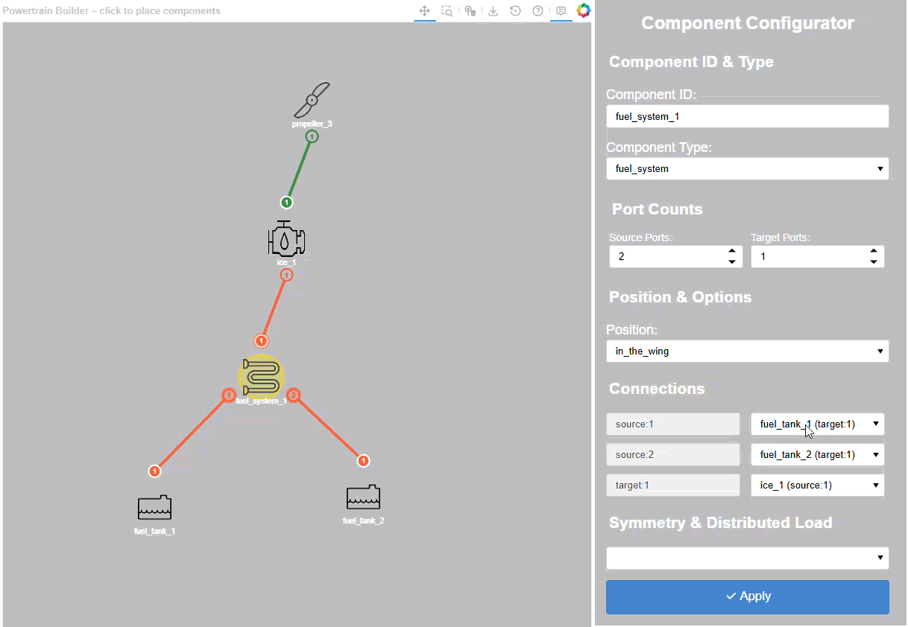

.. _component_connections:

=========================
Component node connection
=========================
To define the components' connections, and to allow more flexibility, two approaches are possible. The first
approach is to select the starting port and then connect to the desired port. The second approach is to configure the
connection directly in each node's properties, shown in the right panel. The highlighted area of the following figure shows
the working area of the node component connection.

Node connection on canvas
=========================
To connect two components on the canvas, click on the starting port of the first component, which will be highlighted
in dashed circle, then click on the desired port of the second component. The connection will be established and a line
will be drawn.

Node connection by drop down menu
=================================
By selecting the desired connection in the drop-down menus under the connection section of the right node properties
panel, a temporary connection will be established. To apply the changes, click on the blue ``Apply`` button at the bottom
of the right panel. If the changes are not applied, the temporary connections will be removed when switching to another
node or selecting another component.

Delete connection by drop down menu
===================================
Another way to delete the connection is to select the empty value in the drop down menu of the right node properties
panel and apply the changes.

