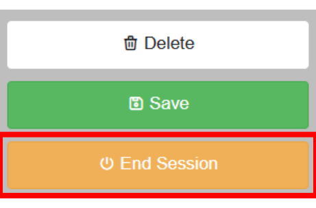
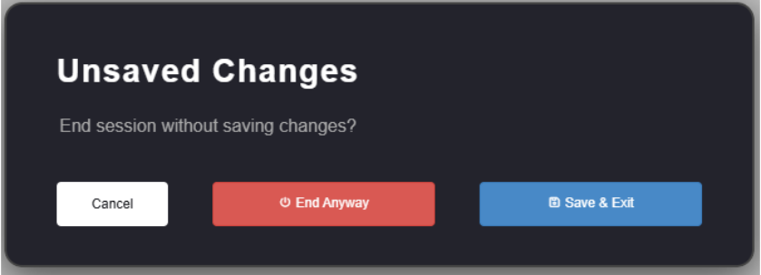

.. _end_session:

===========
End session
===========
To end a session, click on the ``End Session`` button located in the button of the left panel. If the changes are saved,
(save button in green color), the session will be ended and the window will be closed.

If the changes are not saved (save button in yellow color), a pop-up window will appear asking if you want to save the
changes before ending the session. Select ``End Anyway`` to exit without saving, ``Save & End`` to save your changes and
exit, or ``Cancel`` to continue editing.

