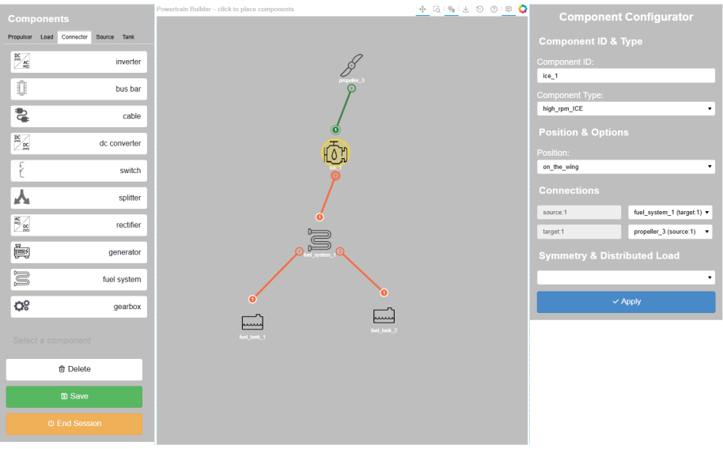

.. _builder:

===============
PT file Builder
===============
The powertrain builder graphical user interface provides a convenient way to create and edit powertrain
configurations for the FAST-GA-HE framework. Once the powertrain configuration is created, it can be saved as a PT file
in YAML format, which can be use in later aircraft sizing or optimization.

.. toctree::
   :maxdepth: 1

    Component node placement <node_placement>
    Component connections <component_connections>
    Delete, undo and redo <undo_redo_delete>
    Node properties configuration <node_properties>
    Save & reload design <save_load>
    End Session <end_session>

To launch the builder, add the following code snippet to your Python script:

.. code:: python

    from fastga_he.gui.power_train_builder import PowertrainBuilderLauncher

    PowertrainBuilderLauncher.launch()

Once loaded from existed design the builder should look like this:

For developers, the following two links are the event flow and the structure map of the builder GUI.

.. raw:: html

    <a href="../../../powertrain_event_flow.html" target="_blank">Powertrain builder runtime event flow</a> 
    <a href="../../../powertrain_structure_map.html" target="_blank">Powertrain builder structure map</a> 
    

