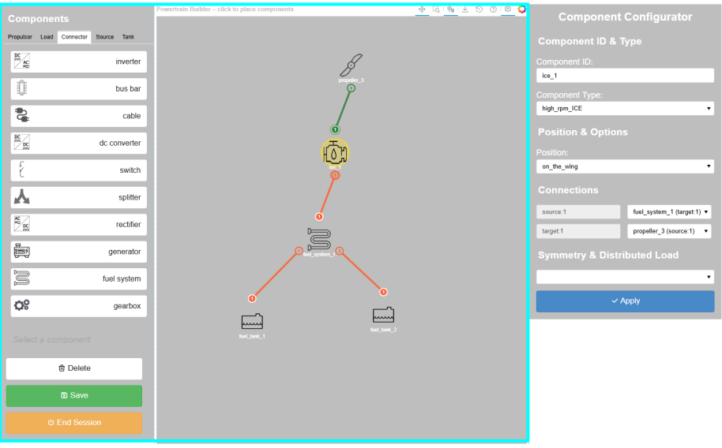
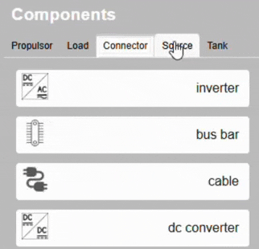
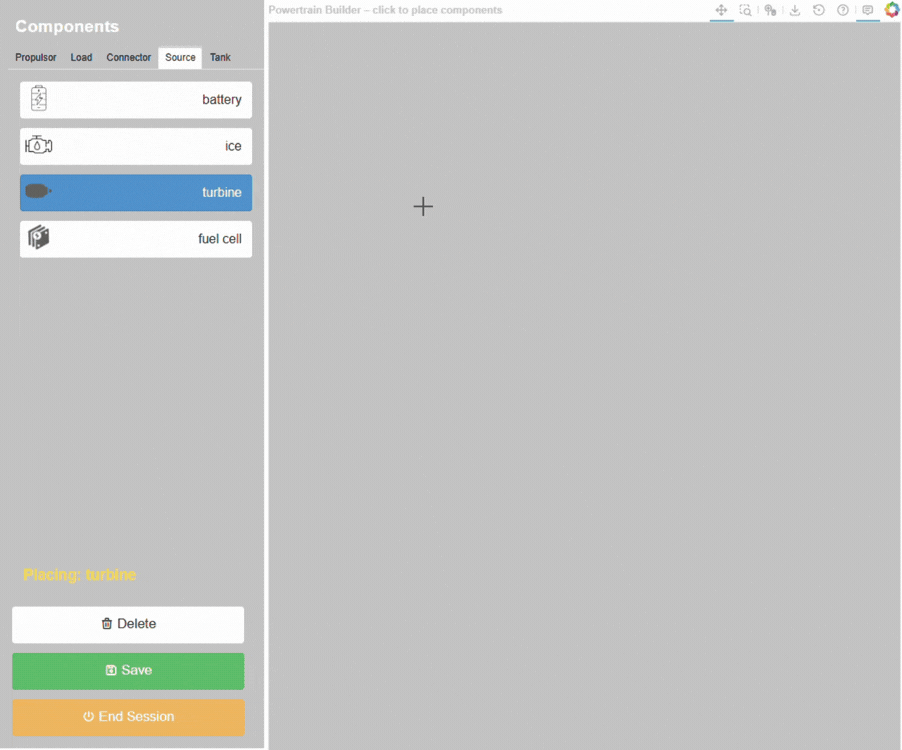

.. _node_placement:

========================
Component node placement
========================
To place the building blocks of a powertrain configuration, the user can drag and drop the components from the left
panel to the canvas. The highlighted area of the following figure shows working area of the node component placement
functionality.

Component type class tabs
=========================
To navigate through the different component type classes, click on the tabs located at the top of the
left panel to switch between different component type classes.

Placing components on the canvas
================================
By clicking the component button on the left panel, the component button will turn blue to indicate that the placement
mode is activated. In this mode, the user can place any component on the canvas by left clicking on it. To exit the
placement mode, click the component button again or click on the delete button to switch to the delete mode.

To switch between different component, simply navigate through the component type class tabs and click on the desired
component button. The placement mode will remain active until the user clicks the highlighted component button again.
