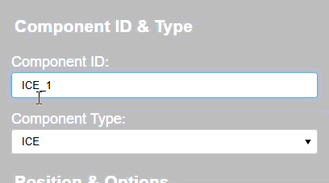
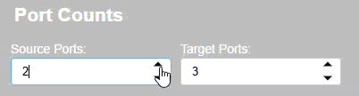
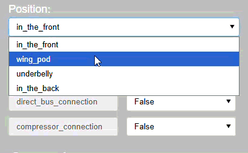
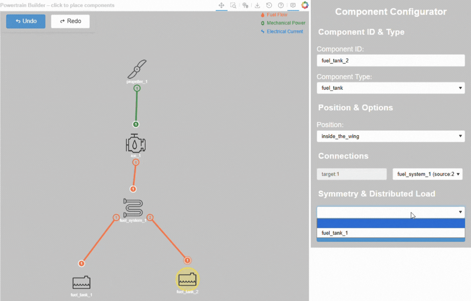

.. _node_properties:

=======================================
Component node properties configuration
=======================================
To configure the properties of a component node, click on the desired component node on the canvas. The right panel will
show up and display the properties of the selected component node, allowing parameter modification. To deselect the
component node, click the selected node again or select another component node. The highlighted area of the following
figure shows the working area of the node configuration.

.. image:: ../../../img/node_connection_highlight.svg
    :width: 600
    :align: center

Component ID and type
=====================
In the first section of the right panel, the component ID and type are displayed. The component ID is a unique
identifier for each component node, while the component type indicates the specific type of component. The component ID
is displayed in an editable text box. The component type is displayed in a drop-down menu, allowing the user to change the
component type if needed. To apply the changes, click on the blue ``Apply`` button at the bottom of the right panel.

Port counts
===========
This section only appears for the component nodes that have multiple target and source ports. The user can change the
number of target and source ports by selecting the desired number in the spinner boxes. To apply the changes, click on
the blue ``Apply`` button at the bottom of the right panel.

Component position and options
==============================
To configure the installation position of a component to the aircraft, available position options can be selected through
the drop-down menu. The option column only appears if the component has configurable options. The allowed entries can
be found in each drop-down menu. To apply the changes, click on the blue ``Apply`` button at the bottom of the right
panel.

Symmetry & distribution load
============================
To prevent double counting the distributed wing load of a component, a symmetrical component can be selected in
the drop-down menu. Once the symmetrical component is selected, the symmetry drop-down menu of the corresponding component
will be automatically updated. To apply the changes, click on the blue ``Apply`` button at the bottom of the right panel.

