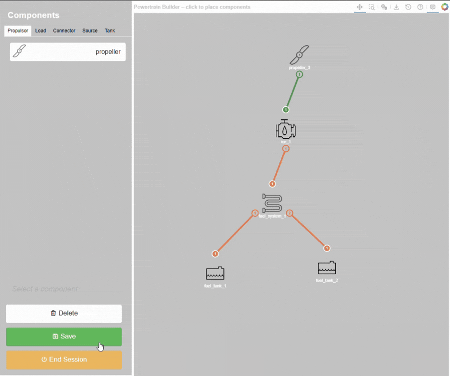
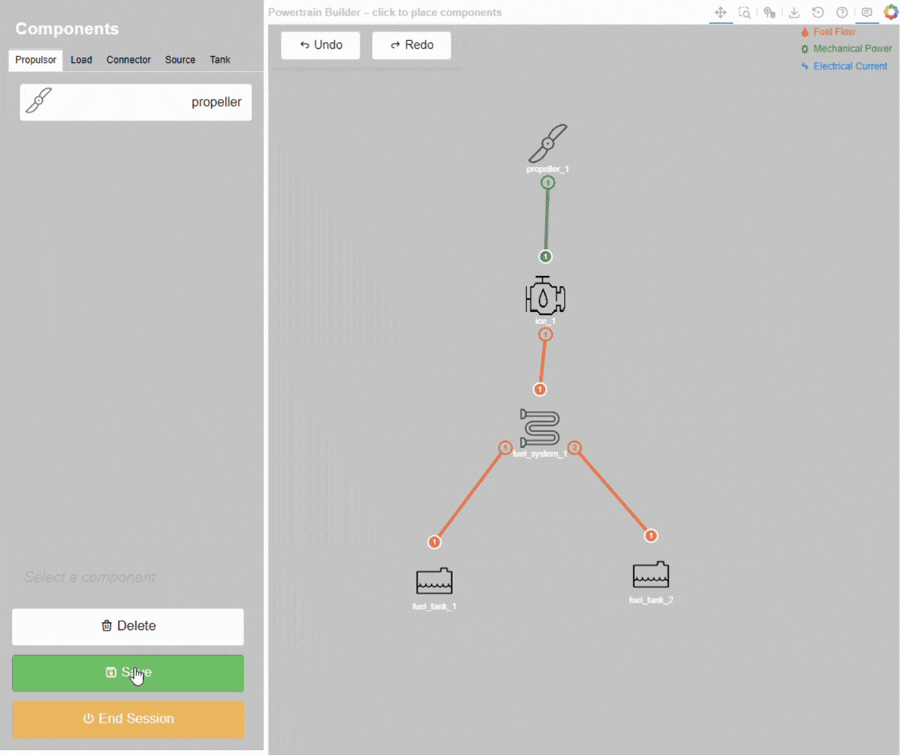
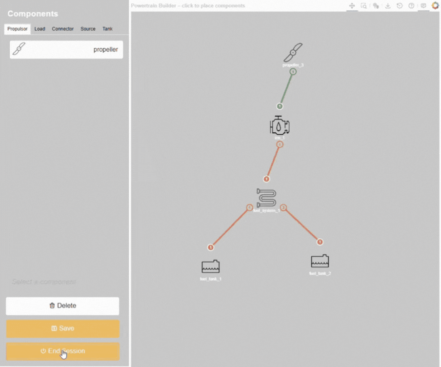
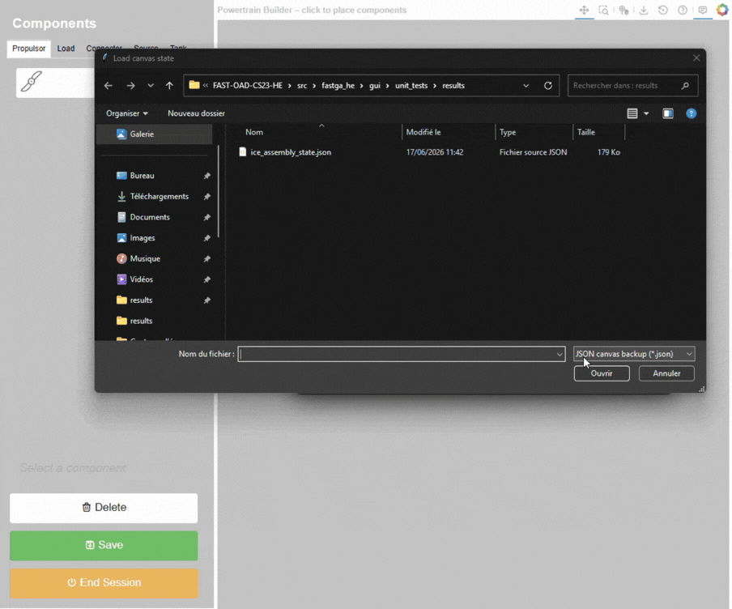

.. _save_load_session:

====================
Save & reload design
====================
The powertrain builder GUI allows users to save their current design for later aircraft design calculation or
reload it later for further editing. This feature is achieve by saving the design as both a PT file in YAML format and a
session state dataset in JSON file. Both files are saved individually based on file name and location configured with
the standard file dialog window.

Saving design
=============
To save a design, click on the white "Save Design" button, which trigger the path selection window for the PT watcher
csv file. This path, added at the end of the PT file, can either hand typed or selected from the standard file dialog
window using the ``...`` button. To leave the path empty, simply click on the "Continue to save" button. To cancel
the saving process, simply cancel the file dialog window. The save action can be performed at any time during the design
process, and the user can continue editing the design after saving.

After the selection of the PT watcher csv file path, the builder will trigger the standard file dialog window to select
the location and name for first the PT file and then the session state JSON file. The user can choose to save either or
both files. To cancel the saving process, simply cancel both the file dialog windows. The save button indication for
unsaved changes will turn green after only one of the two file is saved.

In case of the reminder pop-up window appears while ending a session with unsaved changes, the saving
process is identical to the ordinary saving process. However, once goes through all the file saving dialog windows,
the session will be ended and the window will be closed, even if both file save dialog are cancelled.

Reload design
=============
The reload design function can only be access at the start up window of the builder. To reload a design, click on the
white "Load Design" button, which trigger the open file dialog window. To cancel the reloading process, simply cancel
the file dialog window.

