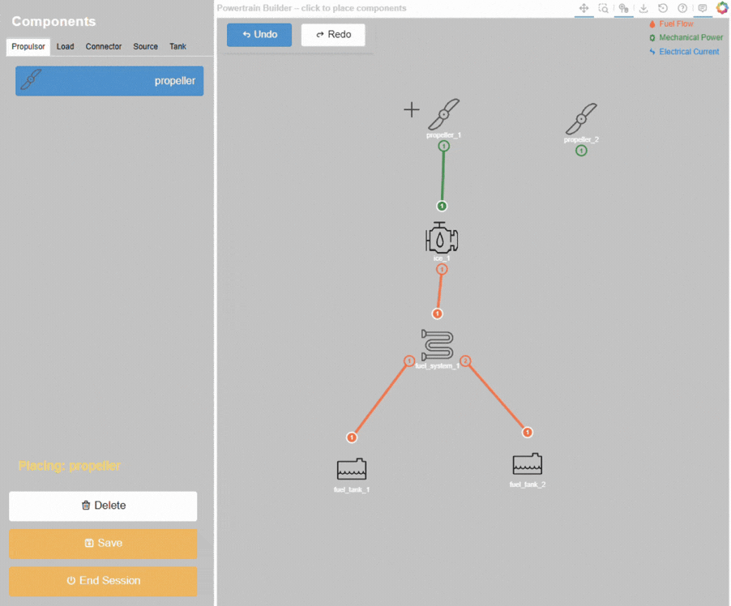
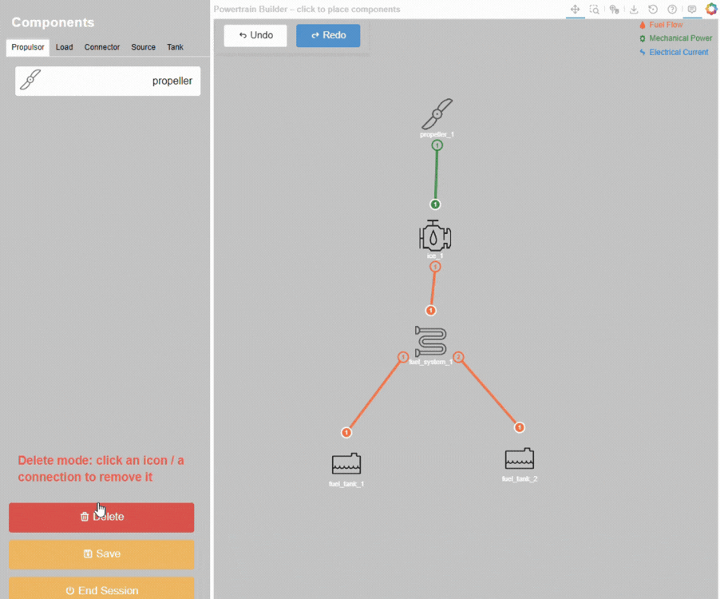

.. _undo_redo_delete:

=====================
Delete, undo and redo
=====================
During the design session, the powertrain builder GUI allows users to undo or redo their last action, as well as delete
selected components or connections. The undo and redo functions can be accessed through the ``Undo`` and ``Redo``
buttons located in the upper-left corner of the center canvas. The delete function can be accessed through the
``Delete`` button located at the bottom of the left panel.

Undo and redo
=============
To undo the last action, click on the ``Undo`` button, which reverts the last change made to the design. Similarly, to
redo the last undone action, click on the ``Redo`` button, which restores the last change that was undone. The undo or
redo action is only available if the button is in blue, which indicates a previous action to undo or redo, respectively.
Once the redo or undo action is performed, the state of the design will be updated as unsaved, even in the case of
reverting to a saved design.

Delete mode
===========
The Powertrain builder GUI allows users to delete selected components or connections in the design. To activate the
delete mode, click on the ``Delete`` button located at the bottom of the left panel. Once the delete mode is activated,
the selected component or connection will be unselected.

