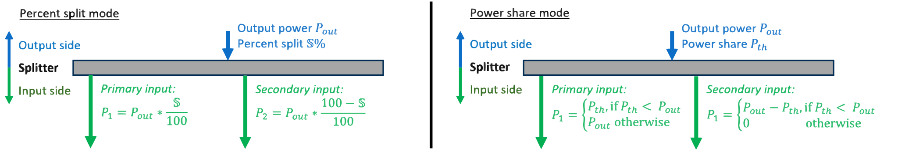

.. _pt-file:

=============================
Powertrain configuration file
=============================

The powertrain configuration file (PT file) defines the powertrain components and their connections. It consists of
four sections:

.. code:: yaml

    title:
    #  Similar to the model configuration file, this gives a name to the architecture.

    power_train_components:
    # Lists all components, including their names, IDs, and option specifications.

    component_connections:
    # Describes how components are connected.

    watcher_file_path:
    # Specifies the path to the CSV file that contains powertrain performances at each time step.

*********************
Powertrain components
*********************

This section contains the specification of the components inside the propulsive system architecture.
The `id` of all existing component that can be added is available in :ref:`Component Constraints and ID <constraint-id>`.

Typical component
=================
Except for the components allowing multiple inputs or outputs connections, most components available in FAST-OAD-GA-he have the same definition format. It is presented here:

.. code:: yaml

    component_1:
    id: fastga_he.pt_component.<component type>
    options:
        # Other options of the component if applicable
    position: # Installation position

Multiple connection component
=============================
Some components like splitter, buses fuel systems or gearboxes, can have multiple connections. Here is demonstrated how
those components should be defined in the PT file. For the `gearbox` and `speed_reducer` components, the number of input
and output connections does not need to be specified — this is automatically handled by the powertrain builder.

.. code:: yaml
    gearbox_1:
    id: fastga_he.pt_component.gearbox
    position:  # Installation position

    speed_reducer_1:
    id: fastga_he.pt_component.speed_reducer
    position:  # Installation position

    fuel_system_1:
    id: fastga_he.pt_component.fuel_system
    options:
      number_of_engines: # Number of engines to connect
      number_of_tanks: # Number of tanks to connect
    position:  # Installation position

    h2_fuel_system_1:
    id: fastga_he.pt_component.h2_fuel_system
    options:
      number_of_power_sources: # Number of power sources to connect
      number_of_tanks: # Number of tanks to connect
    position:  # Installation position

    dc_bus_1:
    id: fastga_he.pt_component.dc_bus
    options:
      number_of_inputs: # Number of inputs to connect
      number_of_outputs: # Number of outputs to connect
    position:  # Installation position

Additionally, for DC splitter and planetary gear component, a working logic must be defined. The two modes are explained
in the following diagram from :cite:`lutz:2025`.

.. code:: yaml

    dc_splitter_1:
    id: fastga_he.pt_component.dc_splitter
    options:
      splitter_mode: # percent_split by default or power_share
    position: # Installation position

    planetary_gear_1:
    id: fastga_he.pt_component.planetary_gear
    options:
      gear_mode: # percent_split by default or power_share
    position: # Installation position

*********************
Component connections
*********************
This section defines the component sequence and the connections of the powertrain architecture. For each connection, the
component placed at the source of the connection is the input value provider and the component placed at target for a
connection is receiver of those values.

One-to-one connection
=====================
This format is applied when the source or target is a component with a single input or output.

.. code:: yaml

    - source: component_1
      target: component_2

Multiple input / output connection
==================================
When the component can have multiple inputs/outputs, the connection index must be specified. The number of connections
must match the number defined in the ``power_train_components`` section. The ``<index of connection>`` should be an
integer starting from 1 up to the number specified in ``power_train_components``.

.. code:: yaml

    # If the multiple connection component is the source of this connection
    - source: [component_1, <index of connection>]
      target: component_2

    # If the multiple connection component is the target of this connection
    - source: component_1
      target: [component_2, <index of connection>]