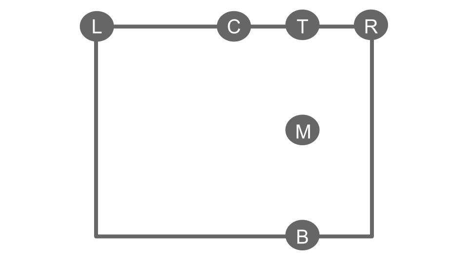

.. _attributes:

=========================================
PT file visualization function attributes
=========================================
Other than the key settings—the PT config file path and where you want to save the HTML—you can tweak several other
options to adjust how the final plot looks.

Sorting reference layer
=======================
This attribute sets the :ref:`reference level <ref-level-sort>` used by the sorting mechanism. The default approach is
the `from-storage approach`, which helps minimise connection crossings. To configure the sorting process to
`from-propulsor approach`, use:

.. code:: python

    power_train_network_viewer(pt_file_path, network_file_path, from_propulsor=True)

Plot orientation
================
This attribute specifies the orientation of the main powertrain architecture. The four valid options are
``"TB"`` (Top–Bottom), ``"BT"`` (Bottom–Top), ``"LR"`` (Left–Right), and ``"RL"`` (Right–Left). To configure the
orientation, use:

.. code:: python

    power_train_network_viewer(pt_file_path, network_file_path, orientation="TB")

Legend position
===============
This attribute specifies the placement of the connection-color legend. Valid entries are:
T (top), M (middle, vertical), B (bottom), L (left), R (right), and C (center, horizontal).

The layout is illustrated below:

To configure the position, use:

.. code:: python

    power_train_network_viewer(pt_file_path, network_file_path, legend_position="TR")

Plot size scaling
=================
This attribute specifies the size factor of the main powertrain architecture from the default settings. Only positive
value is valid. To configure this factor, use:

.. code:: python

    power_train_network_viewer(pt_file_path, network_file_path, plot_scaling=1.2)

Legend size scaling
===================
This attribute specifies the size factor of the connection color legend from the default settings. Only positive
value is valid. To configure this factor, use:

.. code:: python

    power_train_network_viewer(pt_file_path, network_file_path, legend_scaling=1.2)

