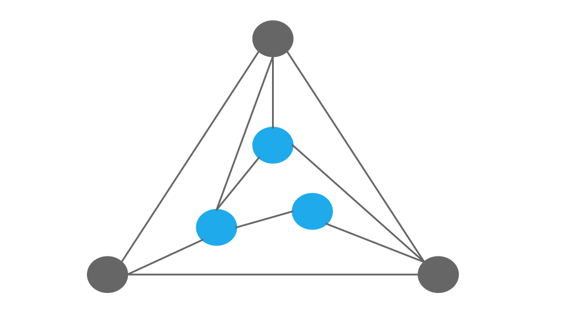
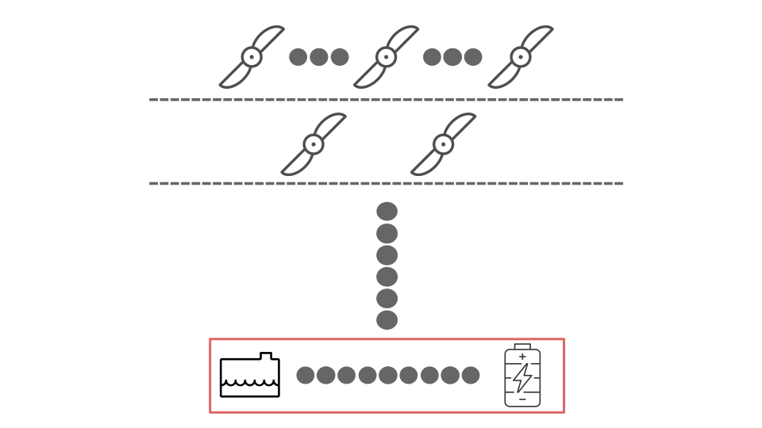
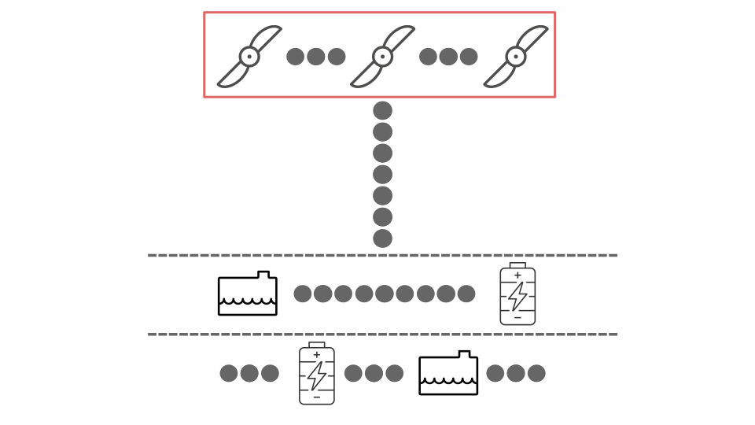
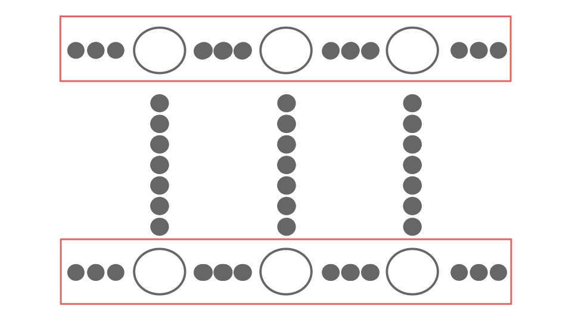

.. _sort_mechanism:

=================
Hierarchy sorting
=================
The sorting mechanism inspired by the `Tutte's drawing algorithm <https://www2.cs.arizona.edu/~kpavlou/Tutte_Embedding.pdf>`_
:cite:`pavlou:2008` is utilized before each visualization. This prevents connection crossing between two layers and allows a more organized presentation of the powertrain
architecture. The sorting process would look like this: `Tutte's drawing sorting <../../../../../visual/tutte_demo.html>`_

Tutte's drawing algorithm
=========================
The Tutte spring theorem, proved by W. T. Tutte :cite:`tutte:1963` in 1963, provides an algorithmic approach with unique
solution for drawing 3-connected planar graphs. The following graph is an example of a 3-connected planar graphs.

This method has since been widely applied in computing embeddings of complex planar polygons when the boundary nodes are
appropriately selected.

.. _ref-level-sort:

Reference level
===============
The reference level definition is one of the two preparation steps before the actual sorting. Two approaches are
considered to define the root of the powertrain architecture tree, starting from storage devices (from-storage) or starting from propulsors (from-propulsor). The from-storage
approach (default) sets all the energy storage components as the reference level of the whole architecture. The
highlighted layer represented the base of the hierarchy.

Similarly to the from-storage approach, the from-propulsor approach sets the propulsor component as the reference
level for the whole architecture.

Boundary nodes
==============
The boundary nodes definition is a critical step for the boundaries of the Tutte's drawing that ensures non-trivial
solution from the linear system. The boundary nodes consist of the nodes in the reference layer and the farthest
layer from the reference layer.

