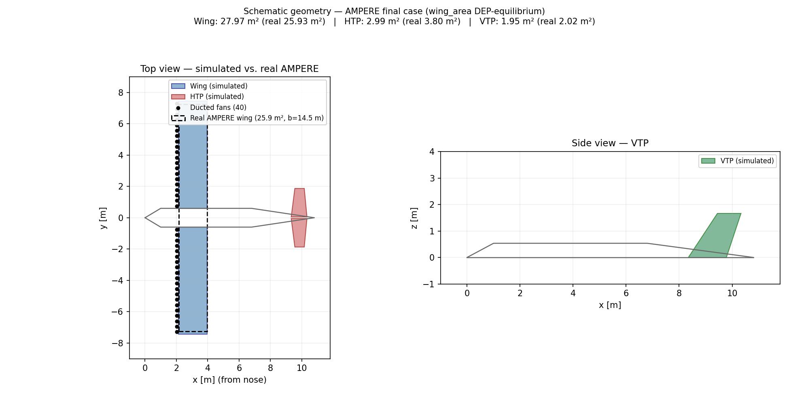
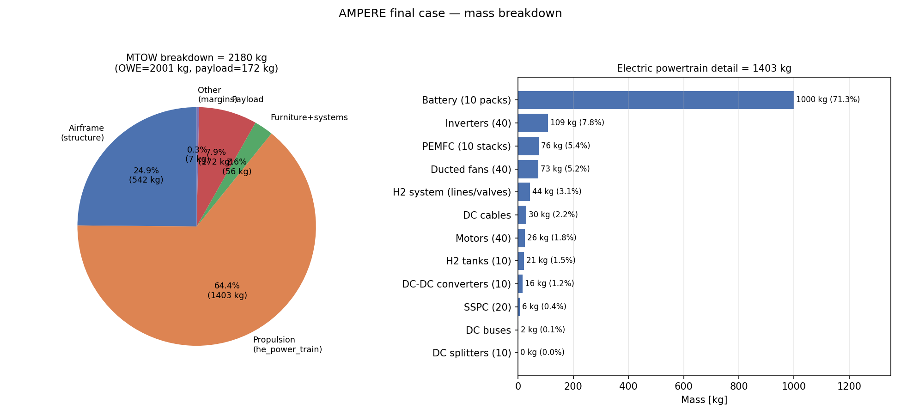
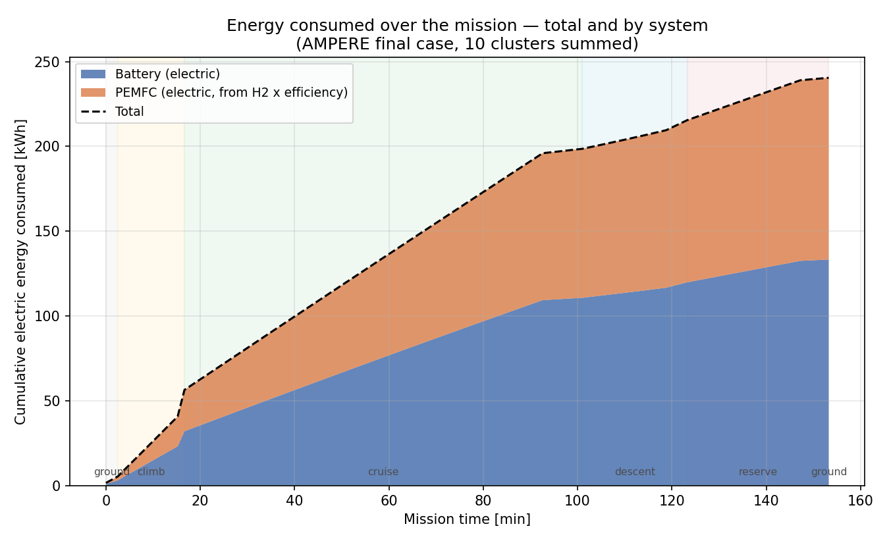
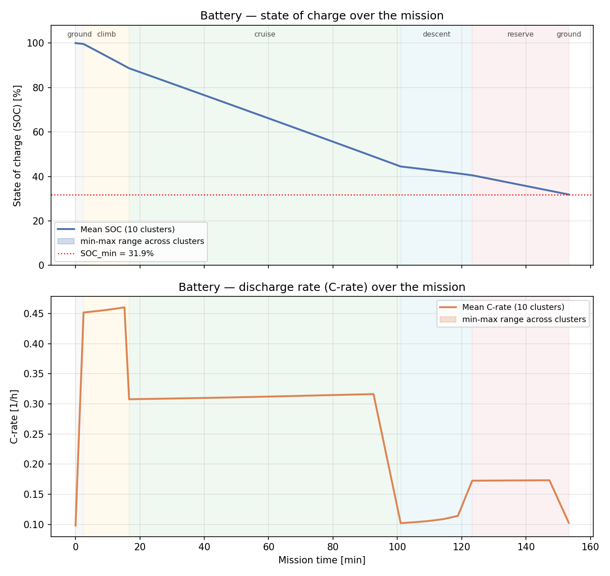
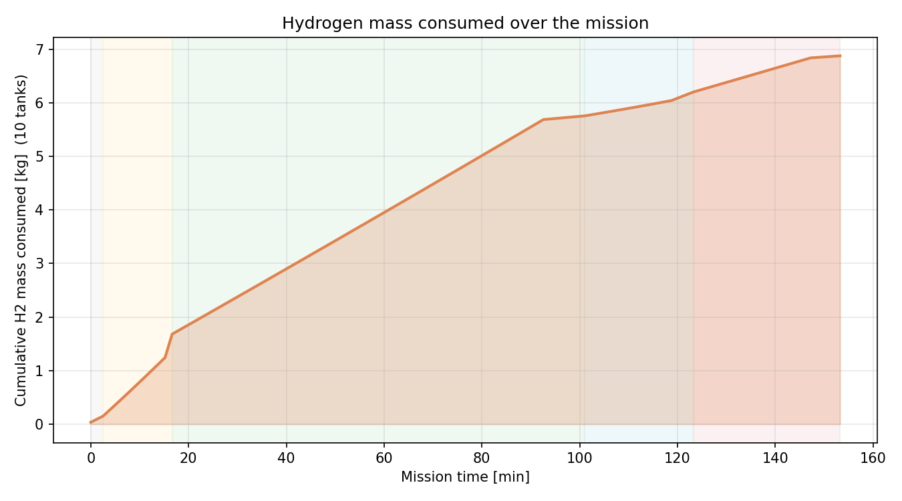

**Case:** `ampere_final` (16 battery modules/cluster, 70% of the power split routed to the battery, wing sizing via `fastga_he.loop.wing_area` — landing/approach equilibrium with slipstream lift augmentation)

## 1. The reference aircraft

AMPERE is ONERA's distributed electric propulsion (DEP) concept plane: a high-wing, CS-23 business aircraft with 40 Electric Ducted Fans (EDF) mounted on the wing leading edge, also used as a high-lift device through the engine-slipstream effect. The hybrid architecture combines PEMFC fuel cells + gaseous hydrogen with batteries, organized into 10 clusters of 4 fans each.

Main TLARs (source: Dillinger, Döll, Liaboeuf, Toussaint, Hermetz, Verbeke & Ridel, *"Handling Qualities of ONERA's Small Business Concept Plane with Distributed Electric Propulsion,"* ICAS 2018-0492, Table 1, reproducing Hermetz, Ridel & Döll, ICAS 2016): 4-6 passengers, 500 km range in ~2h, STOL capability, FL100 ceiling (10,000 ft, unpressurized cabin).

This case in FAST-OAD-CS23-HE reuses the Pipistrel's structural geometry (fuselage, landing gear, tail arrangement) — only the propulsion system (40 EDF / 10 hybrid clusters) and the wing/tail/TLAR parameters were replaced with AMPERE's real values as seeds. In other words: **this is a validation of the propulsion architecture at AMPERE scale, not a faithful, complete sizing of the real aircraft** — see Section 8 for known limitations.

## 2. Main parameters: real vs. simulated

| Parameter | Real (ICAS 2018-0492, Table 1) | Simulated (`ampere_final`) | Difference |
|---|---|---|---|
| MTOW | 2400 kg | 2180.3 kg | -9.2% |
| Wing area | 25.925 m² | 27.97 m² | +7.9% |
| Wing span | 14.5 m | 14.88 m | +2.6% |
| HTP area | 3.8 m² | 2.99 m² | -21.4% |
| VTP area | 2.02 m² | 1.95 m² | -3.6% |
| Number of motors (EDF) | 40 | 40 | equal |
| Installed power (motors + PEMFC) | 400 kW | ≈296 kW | -26.0% |
| Installed energy (battery+H2, LHV basis, estimated) | 500 kWh | ≈432 kWh | -13.7% |
| Range (main route) | 500 km | 500 km | equal (mission input) |
| Payload | 4-6 PAX | 172 kg (not converted to PAX) | — |

**Note on wing/tail:** the wing and VTP converge much closer to the real values after switching the wing-sizing submodel to `fastga_he.loop.wing_area` (`UpdateWingAreaLiftDEPEquilibrium`), which solves a landing/approach equilibrium that accounts for the lift gain from each ducted fan's slipstream — unlike the default `fastga.loop.wing_area` (a pure stall-speed/CL_max formula with zero coupling to propulsion), which had inflated the wing by +41.5% in an earlier run with the same battery sizing. The HTP swung to the undersized side as a side effect — likely because `tail_sizing`/`static_margin` (still the default, non-DEP-aware loops) reacted to the CG shift caused by the smaller wing (see Section 8).

## 3. Geometry

Schematic sketch (not CAD-accurate) built from the span/chord/sweep values in the output XML. AMPERE's real wing (dashed rectangle) is overlaid for scale comparison. The 40 ducted fans are shown along the wing leading edge, matching the real configuration.

## 4. Mass breakdown

The 2180 kg MTOW splits into airframe (542 kg), electric powertrain (1403 kg), furniture+systems (56 kg), and payload (172 kg). Within the powertrain, the battery is the dominant sub-system — a direct reflection of the fixed battery-modules-per-cluster sizing (see Section 8), far heavier than the inverters, PEMFC stacks, or the ducted fans themselves.

## 5. Energy consumed over the mission

Total electric energy consumed over the mission: **240.5 kWh**, split 133.3 kWh (55.4%) from the battery and 107.2 kWh (44.6%) from the PEMFC (electric, computed from H2 consumption × stack efficiency at each point). Mission phases (climb/cruise/descent/reserve) are shaded. The battery figure matches the value reported in the output XML (`energy_consumed_mission` summed over the 10 clusters), confirming the integration.

## 6. Battery — state of charge and C-rate

SOC drops from 100% to 31.9% by the end of the mission (matching `SOC_min` reported in the XML). Maximum C-rate (0.46 1/h) occurs during climb. The min-max range across the 10 clusters essentially overlaps the mean, confirming the expected symmetry of the architecture.

## 7. Hydrogen consumed

Total H2 mass consumed over the mission: **6.875 kg** (10 tanks summed), out of a total onboard capacity of 7.08 kg. Consumption grows roughly linearly during cruise, with higher rates during climb.

## 8. Discussion and known limitations

- **Geometry origin:** fuselage, landing gear, and structural tail arrangement are still inherited from the Pipistrel — only the propulsion system and the main wing/tail/TLAR parameters were replaced with AMPERE's real values. This is not a faithful, complete sizing of the real aircraft.
- **Installed power:** the motors+PEMFC add up to ≈296 kW, versus the published 400 kW — likely because the simulated mission/aerodynamics (still influenced by the Pipistrel) doesn't demand as much peak thrust as the real aircraft would need for its STOL takeoff requirements, which this case doesn't reproduce as an active constraint.
- **Battery sizing:** SOC_min of 31.9% reflects the fixed battery-modules-per-cluster seed in `run_ampere_case.py` (`--battery-modules`, default 16) — re-sweeping it lets you retarget a different SOC floor as the airframe geometry evolves.
- **HTP:** its size is a side effect of the smaller wing on the default (non-DEP-aware) `tail_sizing`/`static_margin` loops — not investigated in depth in this report.
- **Literature correction:** the "32 engines" figure that appears in the paper (Table 1, "Scale 1:5" column) refers to the 1:5-scale wind-tunnel mock-up (32 larger 50mm EDFs reproducing the thrust of 40 smaller 40mm EDFs at full scale), not an engine-out (OEI) redundancy requirement for the real aircraft.

## Sources

- Dillinger, E., Döll, C., Liaboeuf, R., Toussaint, C., Hermetz, J., Verbeke, C., Ridel, M. "Handling Qualities of ONERA's Small Business Concept Plane with Distributed Electric Propulsion." ICAS 2018-0492.
- Output files from the `ampere_final` run (FAST-OAD-CS23-HE): `ampere_final_out.xml`, `ampere_final_mission_data.csv`, `ampere_final_power_train_data.csv`.